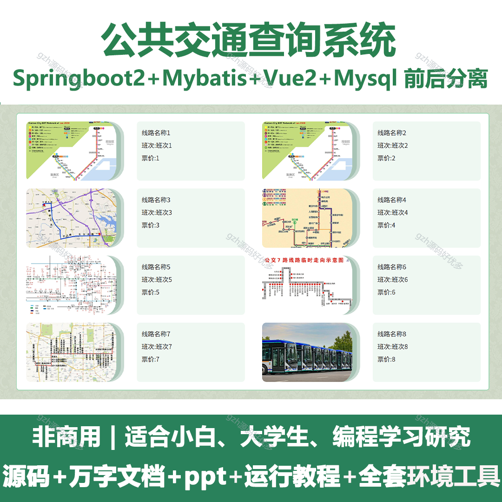

# springbootA259
springbootA259公共交通查询系统
 
## 查看主页获取源码

### 一、关键词
公共交通查询平台，交通出行查询系统，城市公交查询系统

### 二、作品包含
源码+数据库+设计文档万字+全套环境和工具资源+本地部署教程

### 三、项目技术
前端技术：Html、Css、Js、Vue2.0、Element-ui 
后端技术：Java、SpringBoot2.0、MyBatis

### 四、运行环境（以下版本亲测，其他版本兼容性请自行测试）
开发工具：IDEA/eclipse  + VSCODE

数据库：MySQL5.7（最低要5.7版本）

数据库管理工具：Navicat10以上版本

环境配置软件： JDK1.8 + Maven3.6.3

前端Nodejs：14

浏览器：谷歌浏览器

### 五、项目介绍
项目编号：springbootA259

近年来互联网络的迅猛发展和电子终端设备的普及，赋予了各行业充足的发展空间。公共交通查询系统相比于传统信息技术，时效性是它最大的特色，已经在电子娱乐、经济等中发挥着举足轻重的作用。
尽管服务行业已经有了很大程度的发展，但在公共交通查询领域上却少有建树。在信息化的时代，用户只能通过一些类似网站查询公交路线、公交相关等，这样的查询方式仍然是比较机械传统的，本文通过对市面上常见的线上管理系统与现实生活中结合问题的讨论，从一个公共交通查询系统角度进行需求分析，提供一些新的思路，并尝试做一些简单的实现。

### 六、运行截图

